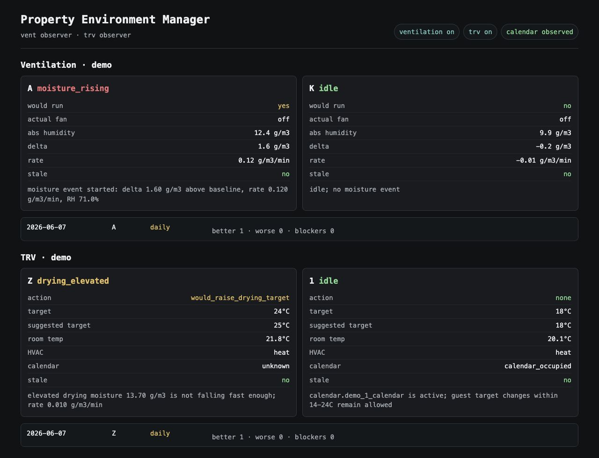

# Property Environment Manager

[](https://github.com/daminpark/property-environment-manager/actions/workflows/checks.yml)

A Home Assistant add-on for running damp and heating automation as an
operational review loop before it is trusted with real devices.

I built this around a real small-property setup where rooms change state for
ordinary reasons: showers, cooking, laundry, guest stays, service rooms, open
windows, stale sensors, and manual overrides. The useful question is not only
"can Home Assistant switch something?", but "would this decision have been
right, why, and is it safe to let it write next time?"



The screenshot is synthetic and redacted, but it shows the intended experience:
one place to see what is damp, what is heating, what the automation would do,
whether the real device agrees, and whether recent observations look safe enough
to promote.

## What It Helps With

- Reviewing humidity and heating state across the property without opening
  several Home Assistant dashboards.
- Seeing the reason for each recommendation, not just the resulting target or
  fan state.
- Comparing "would run" decisions with the real fan or TRV state while still in
  observer mode.
- Catching stale sensors, unavailable TRVs, child-lock drift, HVAC mode drift,
  and rooms that are not warming as expected.
- Keeping guest and service-room heating policy visible before letting the add-on
  enforce it.
- Using daily evidence to decide which automations are ready for active control.

## Who It Is For

This is for a Home Assistant-managed property where environmental automation has
to coexist with guests, service rooms, manual overrides, and imperfect sensors.
It is especially useful when the operator wants to inspect decisions before
giving an automation authority over fans or TRVs (thermostatic radiator valves).

## Product Workflows

### Review the property from one screen

The combined dashboard shows ventilation, TRV heating, and calendar policy
together. Each room card gives the current mode, the suggested action, the
current device state, and the reason in plain operational terms. The status pills
at the top make the rollout state visible: ventilation active or observer, TRV
active or observer, and calendar policy off, observed, or active.

### Handle moisture without brittle timers

The ventilation controller watches absolute humidity, learned room baselines,
rise rate, relative humidity, stale readings, and minimum run time. A shower or
kitchen spike can become a "would run" recommendation before any write is
enabled. In observer mode, the app records whether the actual fan was already on
or whether the automation would have acted differently.

The product decision here is deliberate: a damp room should not be reduced to a
fixed timer, and a stale high reading should not blindly start a fan.

### Watch heating quality, not just setpoints

The TRV side looks for practical heating problems: a drying room that needs a
temporary higher target, a room that is calling for heat but not warming, a TRV
stuck out of heat mode, a child lock that has drifted, or a target that has been
changed outside the expected policy. These are treated as observations first,
with write access kept behind explicit switches.

### Keep guest and service policy reviewable

Calendar policy is mirrored before it is allowed to control devices. The app can
observe check-in and checkout target changes, occupied and vacant states, guest
target bounds, service-room defaults, and renovation-mode suppression. This keeps
booking-related heating behaviour inspectable without publishing booking names or
raw calendar details.

### Promote only after evidence

The add-on starts in observer mode. Daily summaries group observations into
signals such as "would improve current system", "would be worse", and "hard
safety blockers". The point is to make rollout boring: observe, compare, fix the
edge cases, then enable only the write path that has earned trust.

## Safety Model

Default installation is observer-only:

- `vent_active_control: false`
- `trv_active_control: false`
- `trv_active_boiler_control: false`
- `trv_active_calendar_policy: false`

Ventilation writes require `vent_active_control: true`. TRV drying-room writes
require `trv_active_control: true`. Calendar, guest-limit, service-default,
force-heat, and child-lock writes require both `trv_active_control: true` and
`trv_active_calendar_policy: true`. Boiler writes require both
`trv_active_control: true` and the independent
`trv_active_boiler_control: true` gate.

The current ventilation control scope is humidity only. Presence, button,
evening-air-out, and drying-room routines remain Home Assistant-owned during the
first staged cutover. The dashboard reports these ownership requirements rather
than claiming full replacement readiness.

That separation creates four promotion stages: ventilation, drying-room TRV
control, boiler control, and the shared calendar-policy group (calendar
transitions, guest limits, service defaults, force-heat recovery, and child-lock
restoration).

## Demo And Review

The public demo files are synthetic. They are meant to show the shape of the
product without exposing a real property, booking, token, or Home Assistant
entity namespace.

- [Synthetic status payload](demo/status.json)
- [Architecture note](docs/architecture.md)
- [Privacy and safety note](docs/privacy-and-safety.md)

For a fast review, start with the screenshot, then skim the synthetic status
payload to see the same decisions as data. For a deeper review, read the tests
around humidity events, TRV policy, calendar mapping, event summaries, migration,
and sanitisation.

## What The Demo Shows

The current screenshot is the right first image because it compresses several
workflows into one view:

- A moisture event where the app would run a fan but the actual fan is off.
- A drying-room TRV recommendation with a suggested temporary target.
- An occupied guest room where manual target changes remain allowed within the
  policy range.
- Daily evidence rows that show better, worse, and blocker counts.
- Demo entity names and redacted calendar information instead of private
  deployment details.

## What This Is Not

This is not a general-purpose smart-home platform, a commercial product, or an
"AI automation" wrapper. It is a practical Home Assistant add-on extracted from
real property operations. The AI signal is in the workflow: I use coding agents
for review, refactoring pressure tests, documentation passes, and checklist-style
verification, while keeping the product boundaries, safety model, and rollout
decisions mine.

## Public Boundary

No raw production databases, booking names, tokens, IP addresses, or real
calendar details should be committed. Some tests and sanitisation rules still
refer to legacy numeric house/entity patterns because the add-on came from a
real deployment. Public examples should use the synthetic demo namespace or be
sanitised and manually reviewed.

## Development

From the repository root:

```bash
python3 -m venv .venv
source .venv/bin/activate
python3 -m pip install -e "property_environment_manager[dev]"
python3 -m pytest -q
python3 -m compileall -q property_environment_manager/src tests tools
```

The project targets Python 3.12+ because the Home Assistant add-on image uses
Python 3.12. CI runs the same test and compile checks.

## Diagnostics

The add-on exposes one ingress dashboard and API:

- `/api/status` for combined status
- `/api/ventilation/status` for ventilation-only status
- `/api/trv/status` for TRV-only status
- `/health` for a simple health check

Each controller records local SQLite diagnostics under `/data`:

- `/data/ventilation_manager_events.sqlite3`
- `/data/trv_regulator_events.sqlite3`

Raw samples are retained for short-term analysis. Event and daily-summary rows
are retained longer so staged rollout decisions can be reviewed over time.

The TRV status includes one aggregate boiler decision every poll. A known
heating demand can recommend turning the boiler on, but turning it off is only
considered safe when the boiler and every configured TRV report usable state.
All future device commands use state read-back and bounded retries.

## Data Hygiene

Do not commit raw production databases. To preserve history from the old
standalone add-ons, copy the old SQLite files to a local working directory or to
`/share`, then import them into the new database files:

```bash
python3 tools/migrate_legacy_logs.py \
  --source old_ventilation_manager_events.sqlite3 \
  --destination new_ventilation_manager_events.sqlite3

python3 tools/migrate_legacy_logs.py \
  --source old_trv_regulator_events.sqlite3 \
  --destination new_trv_regulator_events.sqlite3
```

For an add-on migration, place the exported legacy files under
`/share/property_environment_manager` using these names before first start:

- `legacy_ventilation_manager_events.sqlite3`
- `legacy_ventilation_manager_state.json`
- `legacy_trv_regulator_events.sqlite3`
- `legacy_trv_regulator_state.json`

The combined add-on uses SQLite's online backup API to create consistent `/data`
copies, runs `integrity_check`, and records one-time import markers. It refuses
to overwrite a database that the combined add-on has already created.

For public examples or external review, create redacted copies:

```bash
python3 tools/sanitize_sqlite.py \
  --source ventilation_manager_events.sqlite3 \
  --destination sanitized_ventilation.sqlite3
```

The sanitizer removes or generalises common private fields such as booking
summaries, guest names, bearer tokens, IP addresses, and house-specific entity
prefixes. Sanitized output should still be reviewed before publishing.

## Home Assistant Notifications

The add-on publishes health entities but intentionally leaves notification
routing to Home Assistant. A reusable, rate-limited package for manager
heartbeats and property-device availability is documented in
[`docs/device-health.md`](docs/device-health.md).
